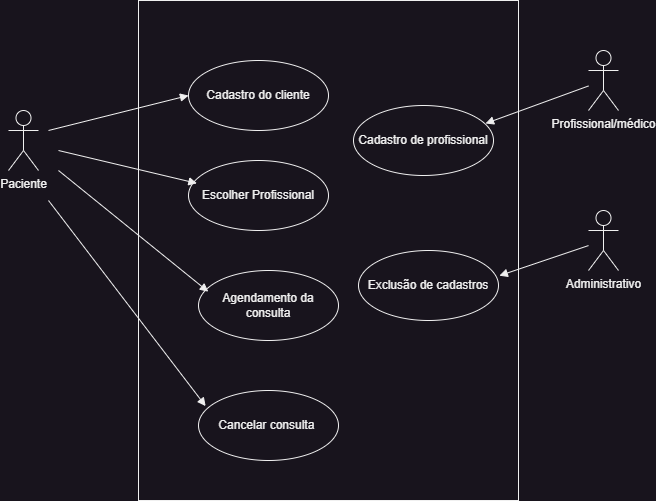

# DOCUMENTAÇÃO DO PROJETO

# SLIME

# INTRODUÇÃO

  O Slime é um aplicativo móvel de saúde bucal desenvolvido com Flutter, projetado para facilitar a jornada ao dentista. Ele permite que os usuários escolham tratamentos com profissionais qualificados, além de verificar se há algum problema que precise de atenção. Com uma interface intuitiva, o app oferece descrições detalhadas de cada procedimento e uma breve introdução do profissional que cuidará de você. Além disso, você pode marcar e acompanhar seus horários de consulta, escolhendo o melhor dia e horário para sua conveniência.

 [Saiba Mais](docs/Introducao.md)

# ARQUITETURA
 
 Para a criação do Slime foi utilizado a arquitetura MVC:

 - **Model**: Pasta na qual fica os arquivos de 
 armazenamento de dados do (Paciente, Profissional, Hoario e dia das consultas ).
 - **View**: Pasta na qual fica a interface da aplicação. Telas de Cadastro de usuário,
 Tela de pesquisa, e a de confirmação.
 - **Control**: Pasta que realiza o processo de intermediação entre **Model** e **View**, sendo
 responsável pelo gerenciamento dos dados entre telas e banco de dados. 
 
 [Saiba Mais](docs/Arquitetura.md)

# FUNCIONALIDADES

 <!-- Codigo para por imagens dentro da documentação -->
 
 
 Explicar as funcionalidades do aplicativo.
 
 1. **Registro de Usuário**
  - os usuários podem criar suas contas com as seguintes informações: nome, número, cidade,
  cpf, email, senha e idade.

  [Saiba Mais](docs/Funcionalidade.md)

   
